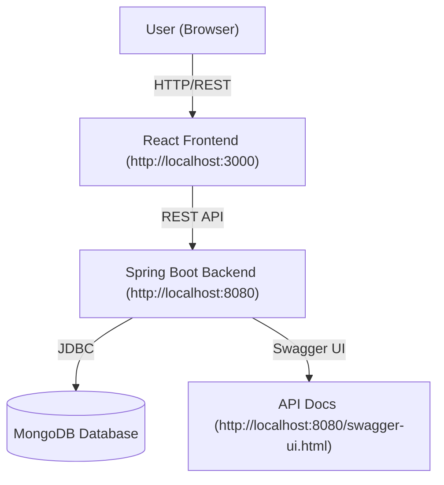

# 🎬 Movie Booking App

[](https://www.java.com/)
[](https://spring.io/projects/spring-boot)
[](https://react.dev/)
[](https://www.mongodb.com/)
[](https://swagger.io/tools/swagger-ui/)
[](https://tailwindcss.com/)
[](https://opensource.org/licenses/MIT)

---

## 📚 Table of Contents

- [Tech Stack](#tech-stack)
- [API Documentation](#api-documentation)
- [Frontend Preview](#frontend-preview)
- [Test Credentials](#test-credentials)
- [Architecture](#architecture)
- [API Overview](#api-overview)
- [Database Schema](#database-schema)
- [Contact](#contact)

---

## 🚀 Tech Stack

| Layer      | Technology         | Badge                                                                 |
|------------|-------------------|-----------------------------------------------------------------------|
| Backend    | Java, Spring Boot |   |
| Frontend   | React, TailwindCSS|   |
| Database   | MongoDB           |  |
| API Docs   | Swagger/OpenAPI   |  |

---

---

## 📑 API Documentation

- **Swagger UI:** [http://localhost:8080/swagger-ui.html](http://localhost:8080/swagger-ui.html)
- **OpenAPI Spec:** See `SWAGGER_DOCUMENTATION.md` in the backend folder

---

## 🖥️ Frontend Preview

- **URL:** [http://localhost:3000](http://localhost:3000)
- Modern, responsive UI with full booking flow and admin management

---


## 🧪 Test Credentials

> **Note:** If you haven't seeded users, register via the app and set the role in the database.

### **Admin User**
- **Email:** `admin@moviebooking.com`
- **Password:** `admin123`
- **Role:** `ADMIN`

### **Normal User**
- **Email:** `user@moviebooking.com`
- **Password:** `user123`
- **Role:** `USER`

---

## 🏗️ Architecture



---

## 📖 API Overview

- **Authentication:** Register, login, JWT-based auth, role-based access (USER, ADMIN)
- **Movies:** List, details, create (admin)
- **Theatres:** List, create (admin)
- **Showtimes:** List, filter, create (admin)
- **Bookings:** Book seats, view/cancel bookings, booking history
- **Health:** Health check endpoint

### Example Endpoints

| Method | Endpoint                       | Description                       |
|--------|-------------------------------|-----------------------------------|
| POST   | `/api/auth/register`          | Register a new user               |
| POST   | `/api/auth/login`             | Login and get JWT                 |
| GET    | `/api/movies`                 | List all movies                   |
| POST   | `/api/movies`                 | Create a new movie (admin)        |
| GET    | `/api/theatres`               | List all theatres                 |
| POST   | `/api/theatres`               | Create a new theatre (admin)      |
| GET    | `/api/showtimes`              | List/filter showtimes             |
| POST   | `/api/showtimes`              | Create a new showtime (admin)     |
| GET    | `/api/bookings`               | Get user bookings                 |
| POST   | `/api/bookings`               | Create a new booking              |
| DELETE | `/api/bookings/{bookingId}`   | Cancel a booking                  |
| GET    | `/api/health`                 | Health check                      |


---

## 🗄️ Database Schema (MongoDB Collections)

### **movies**
```json
{
  "id": "string",
  "title": "string",
  "description": "string",
  "genre": "string",
  "rating": "number",
  "duration": "number",
  "language": "string",
  "posterUrl": "string",
  "releaseDate": "date",
  "createdAt": "date"
}
```

### **theatres**
```json
{
  "id": "string",
  "name": "string",
  "location": "string",
  "totalSeats": "number",
  "rows": "number",
  "seatsPerRow": "number",
  "createdAt": "date"
}
```

### **showtimes**
```json
{
  "id": "string",
  "movieId": "string",
  "theatreId": "string",
  "showDate": "date",
  "price": "number",
  "availableSeats": "number",
  "createdAt": "date"
}
```

### **bookings**
```json
{
  "id": "string",
  "userId": "string",
  "showtimeId": "string",
  "seats": [
    { "row": "string", "number": "number", "status": "BOOKED" }
  ],
  "totalAmount": "number",
  "bookingDate": "date",
  "status": "confirmed|cancelled"
}
```

### **users**
```json
{
  "id": "string",
  "email": "string",
  "name": "string",
  "password": "hashed string",
  "role": "USER|ADMIN"
}
```

---

## ❤️ Made by Sanket

- **GitHub:** [github.com/sanket1805](https://github.com/sanket1805)
- **LinkedIn:** [linkedin.com/in/sanket1805](https://linkedin.com/in/sanket1805)
- **X (Twitter):** [x.com/sanket1805](https://x.com/sanket1805)
- **Contact:** psanket18052001@gmail.com

--- 